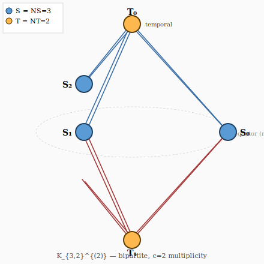

# 213 Diamond Crystal — Geometric Source of Intuition

The shape of the universe in 213 = ultra-densely compressed
diamond.  N Planck-scale lattice points all related (Raw axiom:
G_{ij}), but **compressed by rank ≤ 5** into a single chiral
4-simplex `K_{3,2}^{(2)}` skeleton.

## 1. K_N → K_{3,2}^{(2)} compression

Block universe = N spacetime points; every pair has G_{ij} = ⟨ψ_i|ψ_j⟩
(weighted complete K_N).  Gram is N×N but **rank ≤ d = 5**
(`OS/Atomicity.lean`).  All N states lie in ℂ⁵ regardless of N.
Any 5 LI points form basis = Δ⁴; other N−5 are linear
combinations projected onto its faces.

## 2. Chiral split forces bipartite skeleton

Paper 1: ℂ⁵ = ℂ² ⊕ ℂ³ uniquely.  5 vertices split as:
  * NS = 3 spatial S-vertices (equatorial pillars)
  * NT = 2 temporal T-vertices (polar caps)

Skeleton edges only S-T (no S-S, no T-T) — K_{3,2} structure.
With c=2 multiplicity: edges = c·NS·NT = 12, b_1 = 12−5+1 = **8
= NS²−1 = 1/α_3** (`Physics/PhotonKernel.lean`).

## 3. Why entanglement is automatic

A and B may be far in graph distance, but share same 5 algebraic
axes via rank-5 Gram.  When A vibrates one ℂ⁵ axis, B (sharing
that axis) resonates instantly.  **Entanglement = algebraic
resonance through rank-5 binding**, not signal travel.

Tiny non-zero off-diagonal G_{ij} = experimental evidence
universe is finite block (rank=5), not infinite (rank=∞).

## 4. Formal foundation (all 0-axiom)

`lean/E213/Math/Cohomology/DiamondShape.lean`:

| Claim | Theorem |
|-------|---------|
| 5 vertices = NS + NT | `Diamond.total_vertices` |
| 3 spatial pillars | `Diamond.spatial_pillars` |
| 2 temporal axes | `Diamond.temporal_axes` |
| 6 bipartite spokes | `Diamond.bipartite_spokes` |
| c = 2 multiplicity | `Diamond.lattice_cycle` |
| 12 total edges | `Diamond.total_edges` |
| b_1 = 8 = NS²−1 = 1/α_3 | `Diamond.diamond_b1` |
| Full bundle | `Diamond.diamond_crystal_structure` |

## 5. Cohomology summary

b_0 = 1, b_1 = 8, b_k = 0 for k ≥ 2 (1-dim graph).  Higher
cohomology evaporates in fractal limit; finite block retains
tiny H^{k≥2} residuals — candidates for 8 → 8.48 type
corrections **without SM perturbative running**.

## 6. Geometric intuition (the source)

> "이 우주는 N개의 점이 엮어낸 거대한 그물망 K_N 전체가 강한
> 대수적 압력 (rank=5)을 받아, 카이랄 4-심플렉스 K_{3,2}라는
> 단 하나의 궁극적인 보석 형태로 압축되어 빛나고 있는 다이아몬드"

NOT a fractal expansion of vertices.  The **rank-5 algebraic
image** of K_N, forced into the chiral 4-simplex skeleton by
atomicity.  N points **redundantly overlap** — same 5-vertex
shape appears 10^∞ times, coincident in algebraic ℂ⁵.

This is the geometric source for 213's atomic predictions:
α_3, α_2, α_em, mass ratios, magic numbers — all emerge from
K_{3,2}^{(2)}'s cohomology and the rank-5 compression principle.
