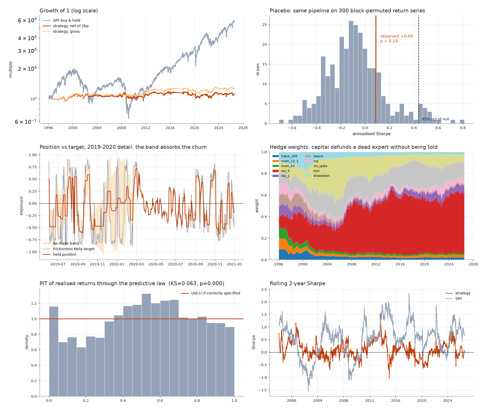

# SPY long/short — PIT, Kelly, no-regret, and an honest null

A single-asset long/short book on SPY, built as a stack of six layers, each one
a different piece of machinery: probability integral transform, causal
estimation with minimax shrinkage, Kelly sizing, a no-regret game against an
adversarial market, a closed-form execution band, and a statistics layer whose
entire job is to try to kill the result.

Part one of two — see [`../README.md`](../README.md) for how this leads into the
cross-sectional study.  Data: SPY, ^VIX, ^IRX daily from Yahoo, 1993-2026.

**The verdict is negative, and that is the deliverable.**  The strategy earns a
net Sharpe of **+0.09** over 7,672 trading days.  The same pipeline, run on 300
block-permuted return series it cannot possibly predict, produces a Sharpe of
**+0.44 or better 5% of the time**.  So the strategy sits at *p = 0.19* against
its own placebo — comfortably inside what the machinery manufactures from noise.



---

## The stack

| Layer | File | What it does |
|---|---|---|
| Signals | `features.py` | 10 deliberately boring experts (trend, momentum, reversal, vol, VRP, VIX spike, turn-of-month, drawdown) |
| PIT | `pit.py` | Expanding empirical CDF → `Φ⁻¹`, putting every signal on one distribution-free ruler |
| Edge | `edge.py` | Causal expanding OLS with minimax soft-thresholding at 1 s.e. |
| Sizing | `edge.py` | Continuous Kelly, `f* = μ/σ²` |
| Game | `game.py` | Hedge / multiplicative weights over the 10 experts |
| Execution | `execution.py` | Closed-form no-trade band from a cost-aware objective |
| Audit | `stats.py` | Block bootstrap, White reality check, deflated Sharpe, PIT calibration, placebo |

### PIT, used twice

The probability integral transform (`F(X) ~ U(0,1)`) shows up in both
directions, which is the tidiest thing in the project.

*Forward*: each raw signal goes through its own **expanding** empirical CDF,
then `Φ⁻¹`.  A momentum score in log units and a VIX spread in vol points now
live on the same ruler with no distributional assumption, and a 2008-sized
outlier can no longer become a 12σ bet.  The expanding window is what keeps it
causal — a full-sample rank would leak the future into every day of the
backtest.

*Inverse*: the **realised** return is pushed back through the model's own
predictive CDF.  If the predictive law were right, those values would be
uniform, so a KS test on them is a direct falsification test of the forecaster.

### Minimax shrinkage instead of a point estimate

We never bet `β̂`.  An adversary picks the true slope anywhere in
`β̂ ± κ·se`, and we bet against the worst member of that set.  Payoff is
monotone in `|β|` near zero, so the worst case is the endpoint nearest zero and
the estimator becomes a soft threshold: an expert with no statistical support
contributes exactly **0**, not noise.  `trend_200` is switched off for 78% of
the sample this way and `lowvol` for 64%, while `rev_5` never is.

### The game layer

Treat the market as an adversary that knows our algorithm.  Under that
assumption "which expert is right?" is not answerable — the adversary would
kill exactly that expert.  What *is* available is a hindsight guarantee.  Hedge,
playing weights `∝ exp(η · cumulative gain)`, gives

```
(best fixed expert in hindsight) − (what we earned)  =  O(√(T log N))
```

distribution-free: no stationarity, no i.i.d., no assumption that the signals
keep working.  It never has to be told a signal died — it defunds it.  The
weights panel in the chart shows exactly that: `mom_12_1` and `trend_200` start
at ~10% each and are down to ~2% by 2004, while `rev_5` climbs to 40%.

Realised regret over the sample: **39.4** against a bound of **94.0**.  The
guarantee held.  It just wasn't worth much, which is the point below.

### The execution band is derived, not tuned

The Kelly target is the optimum of a *frictionless* problem, so a naive book
re-optimises daily and turns over **60×/year** chasing a few basis points.  Put
the cost in the objective: holding `p` is worth `U(p) = mp − (σ²/2λ)p²` per day
for about `h` days, and re-optimising costs `c·|p − p_prev|` now.  With
quadratic `U` and linear cost the solution is a closed-form no-trade band of
half-width

```
w = λ·c / (h·σ²)
```

around the previous position — breach it and you trade only to the *edge* of
the band, never to the frictionless target.  Both inputs are observed, not
fitted: `c` is the commission and `h` is estimated causally from the target's
own AR(1) persistence (median ≈ 4 days).  **No free parameter is added.**

Effect: turnover 60× → 21×/yr, max drawdown −32% → −18%, Sharpe +0.06 → +0.09.
That improvement is mechanical, not data-mined — the single most robust thing
in the project.

### The statistics layer

Four separate attacks, in increasing order of severity:

1. **Stationary bootstrap** (Politis–Romano, mean block 20) — Sharpe +0.09,
   90% CI **[−0.14, +0.32]**, `P(SR ≤ 0) = 0.25`.
2. **White's Reality Check** — the null is "the *best* of the 12 things I tried
   has no edge", so the sampling distribution is that of a maximum.  Best
   candidate `rev_1`, stat 1.74 vs 95% critical value 2.32, **p = 0.20**.
3. **Deflated Sharpe** (Bailey & López de Prado) — under the null, the expected
   *maximum* Sharpe across 12 trials is already **+0.30**, above what we
   observed.  DSR = 0.12 at 12 trials, 0.04 at 50, 0.01 at 200.
4. **Placebo** — re-run the *entire procedure* (ten experts, PIT, slope search,
   Hedge's selection, Kelly, the band) 300 times against block-permuted returns
   containing nothing to find.  Null mean −0.08, sd 0.24, 95th percentile
   **+0.44**.  Observed +0.09 → **p = 0.19**.

The placebo is the strictest of the four because it prices the whole search,
including everything the pipeline does that a per-strategy correction can't see.

---

## Results

| | Sharpe | Ann. return | Ann. vol | Max DD | Turnover |
|---|---|---|---|---|---|
| Strategy, net of 2bp | **+0.089** | +0.6% | 6.8% | −18.1% | 21×/yr |
| Strategy, gross | +0.152 | +1.0% | 6.8% | −16.8% | — |
| Same, no execution band | +0.060 | +0.5% | 8.6% | −31.7% | 60×/yr |
| Equal-weight combo | +0.116 | +0.4% | 3.2% | −15.3% | — |
| SPY buy & hold | **+0.395** | +7.6% | 19.2% | −67.9% | — |

Best standalone experts, net: `rev_1` +0.32, `tom` +0.29, `rev_5` +0.22.  Worst:
`mom_12_1` −0.16, `lowvol` −0.15, `mom_63` −0.14 — cross-sectional momentum
inverted at the index level, which is the textbook result.

Cost sensitivity — the whole thing dies at **5bp**:

| cost | 0bp | 1bp | 2bp | 5bp | 10bp | 20bp |
|---|---|---|---|---|---|---|
| Sharpe | +0.15 | +0.12 | +0.09 | −0.01 | −0.16 | −0.47 |

As an overlay on SPY it is *negative* value: correlation **+0.38**, beta
**+0.13**, alpha t-stat **−0.40** (Newey-West, 10 lags).  Every mix weight
lowers the combined Sharpe (0.395 → 0.361 at 1.0×).  A book that is short 59%
of the time still ends up with positive beta, because the reversal experts buy
into high-volatility days, and that is where the covariance lives.

---

## Three things that did survive

1. **The execution band.**  Deriving the no-trade region from the cost-aware
   objective, rather than smoothing by eye, improved Sharpe, drawdown and
   turnover simultaneously, and did so for all ten experts individually.  No
   parameter was fitted to make it work.

2. **Hedge did its job, and its job wasn't enough.**  It found `rev_5` and
   defunded `mom_12_1` with no supervision, and realised regret stayed well
   inside the bound.  But the combined book (+0.09) underperformed both the best
   single expert (+0.32) *and* naive equal weighting (+0.12).  No-regret is a
   guarantee against an adversarial world; the market is noisy rather than
   adversarial, and in that world the insurance premium is real.  Worth stating
   plainly: **a no-regret guarantee is not an edge.**

3. **The PIT calibration test caught a bug we put in on purpose.**  KS = 0.063,
   p < 0.001 — the predictive law is rejected.  The direction is diagnostic:
   mean PIT is **0.518**, i.e. realised returns land above the predicted mean
   too often.  That is exactly the equity risk premium, which we deliberately
   excluded by dropping the regression intercept to keep the book a pure
   signal-driven long/short.  The test found the omission without being told
   about it.  Tail mass at 5% is 0.103 against a target of 0.100, so the
   *dispersion* is right and only the drift is off.

---

## The honest reading

Ten well-known daily signals on the most efficient, most arbitraged instrument
in the world, combined with the best statistical machinery I can bring, produce
a gross edge of about 1% a year, which is smaller than the transaction costs of
harvesting it and indistinguishable from what the same machinery invents out of
shuffled noise.  This is what an efficient market looks like from the inside.

The machinery is not what failed.  Every layer did what it promised — PIT
normalised, shrinkage silenced dead experts, Kelly sized, Hedge reallocated
within its bound, the band cut turnover 3×.  The layer that mattered most was
the last one, whose only function was to say the number isn't real.  Without
the placebo test, "Sharpe 0.09, max drawdown 18% vs SPY's 68%, flat through
2000-2010 while SPY lost money" is a story you could tell yourself for a long
time.

## Running it

```bash
pip install numpy pandas scipy matplotlib
cd sandbox/longshort
python3 -m spy.fetch_data   # SPY, ^VIX, ^IRX -> spy/data/*.csv
python3 -m spy.backtest     # ~90s incl. 300 placebo runs -> spy/out/
python3 -m spy.plots        # -> spy/out/report.png
```

`Config` in `spy/backtest.py` holds every knob; `placebo_draws=0` skips the slow part.

## Timing contract

`pos[t]` is decided at the close of day `t` and earns `r_fwd[t]`, the excess
return from close `t` to close `t+1`.  Every input to `pos[t]` — PIT quantiles,
regression slopes, EWMA volatility, Hedge weights, the AR(1) holding horizon —
is built only from data stamped `≤ t`.  The regression at `t` sums pairs
`(z[s], r_fwd[s])` for `s ≤ t−1`, since the pair only becomes observable at the
close of `s+1`.  Off-by-one there is the standard way a backtest lies, and the
placebo test is also a check on it: a lookahead bug would show up as an
observed Sharpe far outside the permuted null rather than sitting in the middle
of it.

## Limitations

- Daily closes only; no intraday, no overnight/intraday split, no borrow cost
  on the short leg, no financing spread beyond the T-bill rate.
- Costs modelled as linear in turnover.  Real impact is concave-then-convex and
  regime-dependent; the 5bp break-even is therefore optimistic in a crisis.
- The 10 experts were chosen from what is publicly documented, before running
  anything, but they were not pre-registered, so their pool composition is
  itself a soft researcher degree of freedom.  The placebo null prices the
  search *given* the pool, not the choice of the pool.
- The Gaussian predictive law used for Kelly and calibration is rejected by its
  own KS test, so `f* = μ/σ²` is an approximation. A Student-t predictive law
  would be the natural next step.
