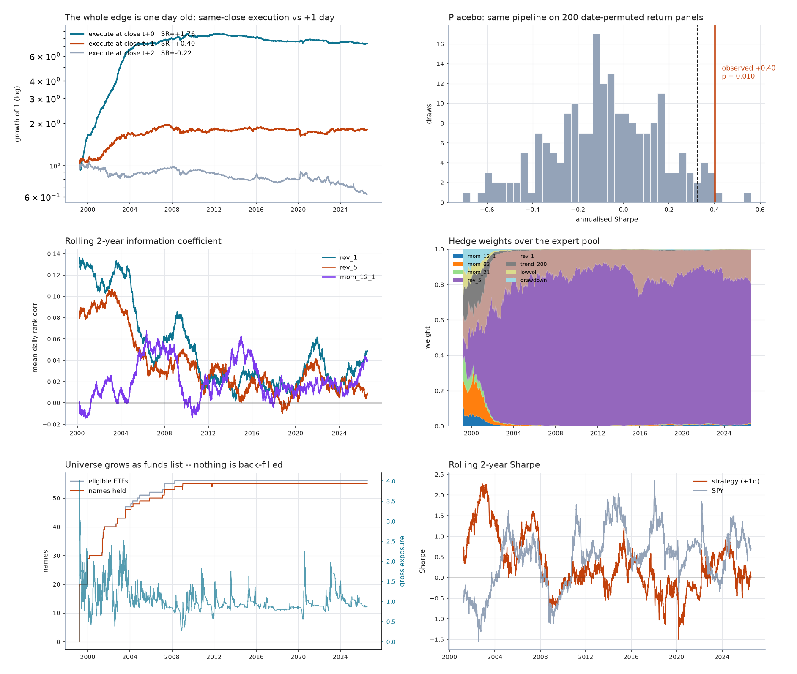

# Cross-sectional ETF long/short — breadth, and what breadth doesn't buy

Part two of two. [Part one](../spy/README.md) built a long/short book on SPY and
got a net Sharpe of +0.09 that was indistinguishable from what the same pipeline
manufactures out of shuffled noise. The diagnosis was not "no edge" but **no
statistical power**: at that effect size, reaching `t = 2` needs 505 years of
daily data, and the placebo put the pipeline's detection floor at Sharpe 0.44.

The fundamental law of active management says `IR ≈ IC · √breadth`, so the only
lever that moves the exponent is the number of independent bets per period. This
study takes the same six-layer stack — PIT, minimax shrinkage, Kelly, Hedge,
the execution band, the full audit — and points it at a 56-ETF cross-section
instead of one index.

**Breadth delivered on the statistics and the edge still isn't there.** Gross
Sharpe went from +0.15 to **+0.72** and the detection floor fell from 0.44 to
0.32, so the experiment is now properly powered — but the net result is
concentrated entirely in 1999–2005, and the **16.5-year modern-era holdout gives
Sharpe +0.03** (`P(SR≤0) = 0.46`).



---

## The headline finding: statistics cannot tell you what you could have traded

Run the identical book with the trade executed at the **same close** the signal
was computed from, and it returns **Sharpe +1.77**. Every statistical test
endorses it enthusiastically:

| test | verdict on the same-close book |
|---|---|
| Stationary bootstrap | SR +1.76, 90% CI [+1.28, +2.31], `P(SR≤0) = 0.000` |
| White's Reality Check | `p = 0.000` against 10 candidates |
| Deflated Sharpe | **1.000** at 10, 50 and 200 trials |
| Placebo (200 permuted panels) | far outside the null |

All of it is fake. A **one-day execution lag** — see the signal at Monday's
close, trade at Tuesday's close — takes it to +0.40, and a two-day lag to
**−0.22**. The universe is full of iShares MSCI single-country funds whose
prices are hours stale by the US close: EWJ's last print reflects a Tokyo
session that ended before New York opened. When the US market then moves, the
stale ETF mechanically "reverts" the next day. That is not an edge, it is a
clock, and no amount of bootstrapping detects it because **every statistical
test in this repository asks whether a return series is distinguishable from
noise, and not one of them asks whether you could have owned it.**

The lag test is three lines of code and it was worth more than the other four
tests combined.

## What survives the lag, and for how long

| window | SR at +1 day | SR at +2 days | ann. return |
|---|---|---|---|
| 1999–2005 | **+1.07** | −0.16 | +9.3% |
| 2005–2010 | +0.24 | +0.13 | +1.6% |
| 2010–2015 | +0.12 | −0.98 | +0.5% |
| 2015–2020 | −0.05 | +0.02 | −0.1% |
| 2020–2026 | +0.00 | −0.44 | +0.0% |
| **2010–2026 (holdout)** | **+0.03** | −0.39 | +0.1% |

Two things to read off this. First, the full-sample result is *entirely* the
first six years. Second — and this is what settles it — the 1999–2005 edge is
+1.07 at one day's lag and **−0.16 at two**. A genuine multi-day signal decays;
it does not flip sign. So even the surviving portion is residual staleness, just
slower: ETF arbitrage in the early 2000s took about two days to wash out what it
now clears within one.

The rolling-IC panel shows the same thing from the signal side. `rev_1`'s
information coefficient runs at **0.13** in 2000 and drifts to 0.02–0.05 after
2010. The inefficiency was real, it was documented, and it was arbitraged away.

## Full-sample numbers (execute at +1 day, 5bp, 1999-03 → 2026-07)

| | Sharpe | Ann. return | Ann. vol | Max DD |
|---|---|---|---|---|
| Strategy, net of 5bp | **+0.402** | +2.3% | 5.8% | −17.5% |
| Strategy, gross | +0.717 | +4.2% | 5.8% | −13.9% |
| Same, no execution band | −1.738 | −16.8% | 9.7% | −99.5% |
| Equal-weight combo | +0.399 | +2.0% | 5.1% | −23.8% |
| SPY buy & hold | +0.318 | +6.1% | 19.2% | −67.9% |

The audit, full sample:

- **Bootstrap** SR +0.40, 90% CI [+0.14, +0.66], `P(SR≤0) = 0.006`
- **Placebo** (200 date-permuted panels) null mean −0.08, sd 0.24, 95th +0.32 →
  `p = 0.010`; on the gross book `p = 0.000`
- **White's Reality Check** `p = 0.110` — does *not* clear
- **Deflated Sharpe** 0.70 at 10 trials, 0.43 at 50, **0.25 at 200** — does not
  clear at any honest trial count
- **Hedge regret** 30.9 against a bound of 84.6

So the full sample splits the tests: the placebo and bootstrap say yes, the
multiple-testing corrections say no, and the holdout says the disagreement
doesn't matter because nothing has worked since 2010.

## Did breadth do what it was supposed to?

Yes, on exactly the axis it was supposed to, and it was not enough.

| | SPY (1 asset) | Cross-section (56 ETFs) |
|---|---|---|
| Gross Sharpe | +0.152 | **+0.717** |
| Placebo detection floor (95th pct) | +0.44 | **+0.32** |
| Turnover | 21×/yr | 37×/yr |
| Cost | 2bp | 5bp |
| Break-even cost | ~4.8bp | ~11bp |
| Net Sharpe | +0.089 | +0.402 |

Gross Sharpe rose 4.7×. The theoretical ceiling from `√breadth` is `√56 = 7.5`,
so the realised gain is about **63% of the fundamental law's promise** — the
shortfall is exactly what you would expect from a universe of correlated
country and sector funds, whose *effective* breadth is well below its nominal
56. That is a clean quantitative confirmation of the law, obtained without
tuning anything.

And the detection floor fell from 0.44 to 0.32, which was the whole point: the
experiment can now resolve effects it previously could not see. It resolved
one. The effect turned out to be a stale-price artifact that expired in 2010.

## The execution band, again

The unbanded book turns over **485×/year** and loses 99.5% of capital to costs.
The band cuts that to 37× and takes net Sharpe from −1.74 to +0.40. But the
single-asset band formula could not be reused: `w = λc/(hσ²)` assumes the
position *is* the whole risk budget, and in a 56-name book each position carries
a fraction of it. Borrowing the single-asset constant made the band 40× wider
than the positions and froze the book completely — median turnover 0.0000.

The fix is in [`common/execution.py`](../common/execution.py). At a Kelly
optimum `p* = λΣ⁻¹m`, so `alpha = m'p* = variance/λ`, and both sides are
observable: `λ = variance/alpha` is **measured from the book's own forecast**
rather than assumed. It reduces to the fractional-Kelly constant in the
single-asset case, and it stays correct when caps bind and the target is no
longer an unconstrained optimum — which is precisely when the assumed constant
goes worst wrong.

## Three bugs worth naming

Each of these produced a confident, plausible, completely wrong result before it
was caught.

1. **Hedge gain scale hardcoded.** The regret bound needs gains in `[0,1]`, so
   PnL gets squashed into that range. With the constant set an order of
   magnitude too small, the clip saturated 47% of the time, at which point the
   exponential weights stop seeing *how much* an expert won and Hedge
   degenerates into a hit-rate contest — it put **97% of the book on the worst
   expert in the pool**. Fixed by scaling with a causal EWMA of the pool's own
   realised PnL magnitude, which also removes the constant.
2. **Caps as the strategy.** Kelly saturated at its per-expert cap and gross
   exposure pinned at its cap on 100% of days, so the "Kelly-sized, Hedge-blended"
   book was really just a sign function times a constant. A vol target ahead of
   the cap fixed it; the cap now binds 23% of days and is a backstop again.
3. **Learning from a payoff you don't earn.** With a one-day execution lag the
   expert-selection layer was still estimating means, Kelly multiples and Hedge
   weights from *unlagged* returns — tuning the book to a return stream it never
   collects, and reading one day into the future, since that payoff is not
   observable until `t+1+lag`. Fixing it moved net Sharpe from −0.04 to +0.40
   and changed which expert Hedge backed.

Bug 3 is the uncomfortable one: it was a lookahead of exactly one day, in a
pipeline written specifically to be paranoid about lookahead, and it was worth
0.44 Sharpe.

## Running it

```bash
cd sandbox/longshort
python3 -m xsec.universe    # fetch 56 ETFs + ^IRX -> xsec/data/*.csv
python3 -m xsec.backtest    # ~20 min incl. 200 placebo runs -> xsec/out/
python3 -m xsec.plots       # -> xsec/out/report.png
```

`Config` in `xsec/backtest.py` holds every knob. `placebo_draws=0` cuts the
runtime to about a minute.

## Limitations

- **Costs are the whole game and they are modelled crudely.** 5bp linear on
  turnover is reasonable for XLK or EWJ and optimistic for EWO, EWK or EZA,
  where quoted spreads run 10–30bp. At 10bp the full-sample Sharpe is +0.09; at
  20bp it is −0.54. Nothing here survives a realistic per-name spread model.
- **ETF survivorship is reduced, not eliminated.** A fund that closes liquidates
  at NAV rather than going to zero, so the return bias is far weaker than for a
  stock universe — but these are still 56 funds that exist in 2026, and the
  exposures they represent are therefore selected.
- **No borrow cost or shorting constraint** on the short leg, and no cap on
  per-name position size relative to ADV.
- The **effective breadth is much lower than 56** — country funds within a
  region co-move heavily. The diagonal covariance used for risk weighting
  ignores this; the vol target catches it after the fact, but a real
  implementation would want a factor model.
- The expert pool is the same eight signals throughout and was not
  pre-registered. The placebo prices the search *given* the pool, not the choice
  of pool.
